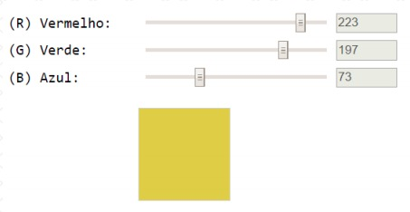
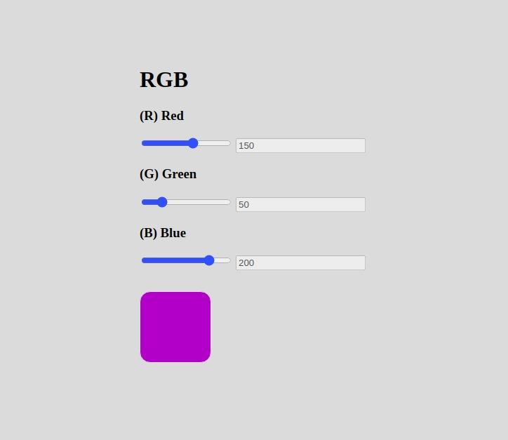

<h1>"Calculadora" de Cores</h1>

Este projeto foi o trabalho prático solicitado no Módulo 1 do Bootcamp Online - Desenvolvedor Full Stack.

Enunciado do projeto:

"Construa, utilizando HTML, CSS e JavaScript puro, uma aplicação para a visualização de cores a partir da escala RGB.

Os alunos deverão desempenhar as seguintes atividades:

1. Implementar, através de HTML, CSS e JavaScript puro, uma aplicação que
contenha três inputs do tipo “range”, cujos valores vão de 0 a 255 e representem,
respectivamente, R (Red – Vermelho), G (Green – Verde) e B (Blue – Azul).
2. Essa combinação de valores deve ser utilizada para preencher a cor de fundo de
uma 
 quadrada. 
3. Além disso, inclua três inputs de texto somente-leitura (desabilitados) para a
visualização do valor atual de cada input do tipo range.
4. À medida em que o usuário modifica o valor dos ranges com as teclas ← e → do
teclado, a 
 deve refletir a cor correspondente.
5. A imagem abaixo ilustra uma possível interface para a aplicação.

O objetivo deste trabalho foi exercitar os seguintes conceitos trabalhados no módulo:

- Utilização de elementos HTML.
- Utilização de CSS.
- Utilização de identificadores em elementos HTML.
- Captura de referência de elementos com JavaScript.
- Manipulação de eventos com JavaScript.
- Utilização de funções com JavaScript e CSS.
- Manipulação direta de CSS com JavaScript"

Este é o resultado do meu trabalho:

